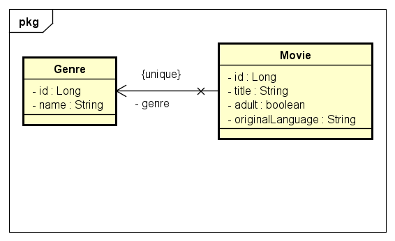
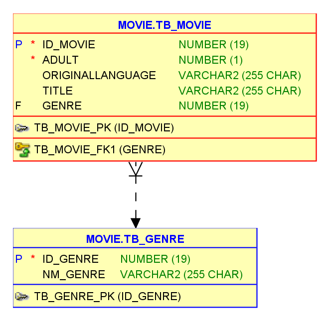

# Benezinho - Pictures 🍿 🤓👍🏾

|                | **Domain Driven Development** |
|------------------------------------------|-------------------------------|
| **ALUNO:**                               | **TURMA:**      1TDSA 2023    |
| **PROFESSOR:** Benefrancis do Nascimento |                               |
| **SIMULADO**                             | 09/11/2023                    |

# Sumário

[Estudo de caso ](#_Estudo_de_caso)

[O que deverá ser feito? ](#_O_que_devera_ser_feito)

[Diagrama de Classes ](#_Diagrama_de_Classes)

[Diagrama de Entidades e Relacionamentos ](#_DER)

[Correção ](#_Correcao)

<a id="_Estudo_de_caso"></a>

# Estudo de caso

A Holding Benezinho  não para de crescer, para o próximo
ano a equipe de tecnologia pretende disponibilizar para o grande público uma plataforma de filmes e séries. O objetivo é
fornecer serviços com mais qualidade que os atuais.

A empresa passará a disponibilizar Aplicativo em território nacional.

Contratamos você como Engenheiro de Software para nos ajudar a construir esse sistema.

Na sprint atual, você foi incumbido de fazer:

1. A correta persistências de todas as entidades.

3. A criação de dos métodos capazes de realizar operações respeitando as interfaces genéricas Repository, Service e
   Resource:

<a id="_O_que_devera_ser_feito"></a>

# O que deverá ser feito?

**Faça o Fork do projeto no github do professor :**

https://github.com/Benefrancis/benezinho-picture.git

Caso o github esteja indisponível, você deverá pegar o projeto no diretório compartilhado.

**Você deverá:**

Alterar o arquivo contido em documentacao/equipe.txt para incluir o RM do aluno que fará esta atividade.

1. **(10 Pontos)** Implementar corretamente todas as classes conforme solicitado abaixo:


1. **(4 Pontos) Domínio Genre**
    1. (2 Pontos) **Implementar corretamente a classe GenreRepository**
    2. (0,5 Ponto) **Implementar corretamente a classe GenreService (Não pode existir dois Generos com mesmo nome)**
    3. (0,5 Pontos) **Implementar corretamente a classe GenreResource (Tem que receber e Retornar DTOs)**
    4. (1 Ponto) **Implementar corretamente a record GenreDTO**
        1. (0,5) Implementar Corretamente o método **public static GeneroDTO of(Genero g)**
        2. (0,5) Implementar Corretamente o método **public static Genero of(GeneroDTo dto)**


2. **(6 Pontos) Domínio Movie**
    1. (3 Pontos) **Implementar corretamente a classe MovieRepository**
    2. (0,5 Ponto)  **Implementar corretamente a classe MovieService (Não pode existir dois Movies com mesmo title)**
    3. (0,5 Pontos) **Implementar corretamente a classe MovieResource (Tem que receber e Retornar DTOs)**
    4. (2 Ponto) **Implementar corretamente a record MovieDTO**
        1. (0,5) Implementar Corretamente o método **public static MovieDTO of(Movie m)**
        2. (1,5) Implementar Corretamente o método **public static Movie of(MovieDTo dto)**

Deverá implementar:

<a id="_Diagrama_de_Classes"></a>

# Diagrama de Classes de Domínio



 

<a id="_DER"></a>

# Diagrama de Entidades e Relacionamentos




<a id="_Correcao"></a>

# Correção da Prova

A correção da prova será disponibilizada no github do professor (branch correcao):

Para acessar digite no prompt:

```shell
git clone https://github.com/Benefrancis/benezinho-picture.git && cd javapet && git checkout correcao
```

A atividade é individual, em caso de fraude de qualquer tipo todos os envolvidos receberão nota ZERO.

Boa prova.
